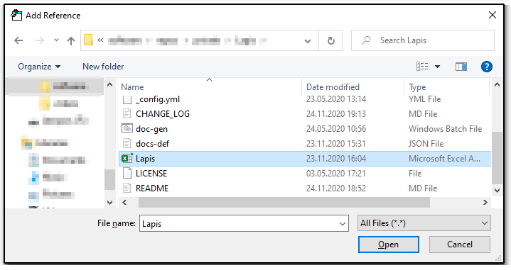

# Lapis

Lapis is an Excel Add-in with collection of various methods and data types which will increase developer's efficiency and reduce development time while working with VBA.

## Getting started

To start using Lapis, download **Lapis.xlam** file and add reference to it in your VBA project.

## API documentation

Documentation can be found under [this link](./doc/index.md).

## Change log

If you would like to to see the change log, please refer to the [change log file](./CHANGE_LOG.md).
